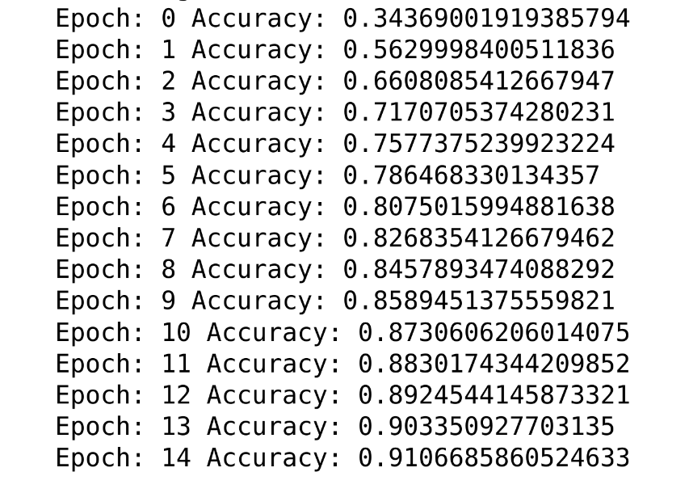

# Google Inception V3

## Introduction

This is a PyTorch implementation of Google's Inception module architecture as described in the paper [Rethinking the Inception Architecture for Computer Vision](https://arxiv.org/abs/1512.00567). This model is trained for classification on the CIFAR-10 dataset.

## Usage

### Training

To train the model, run `python train.py`. The script will automatically download the CIFAR-10 dataset and train the model for 200 epochs. The model will be saved to `model.pth` after training.

Trained on T4 GPU available on Google Colab. Stored model is stored in mounted google drive and then downloaded to local machine.

### Evaluation

To evaluate the model, run `python eval.py`. The script will automatically download the CIFAR-10 dataset and evaluate the model on the test set. The top-1 and top-5 error will be printed.

## Results

## References

- [Rethinking the Inception Architecture for Computer Vision](https://arxiv.org/abs/1512.00567)